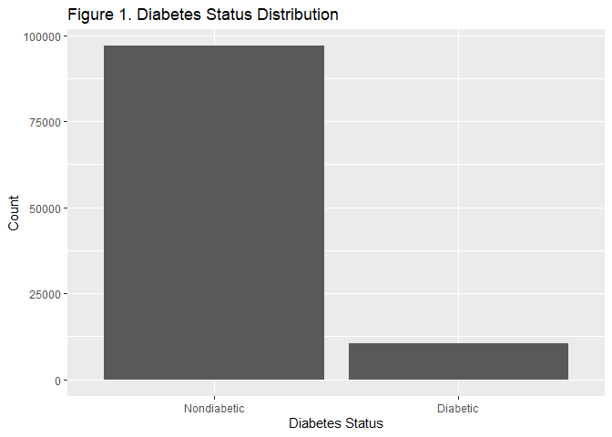
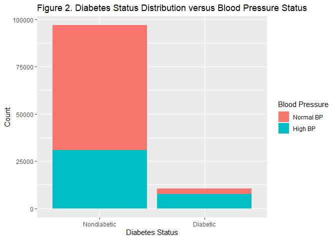
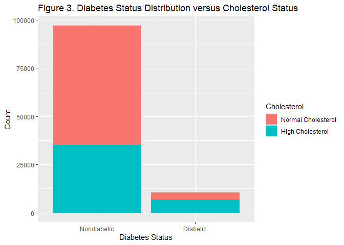
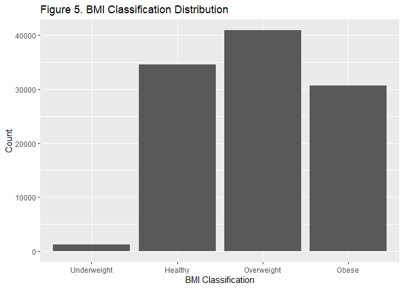
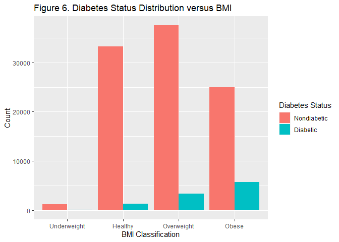
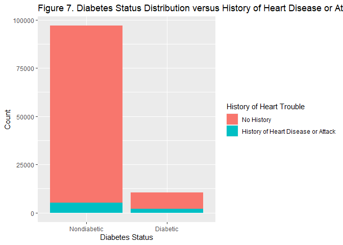
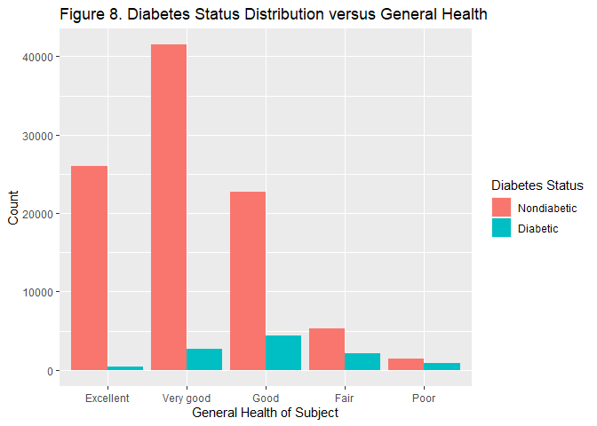
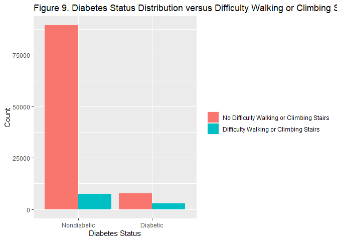
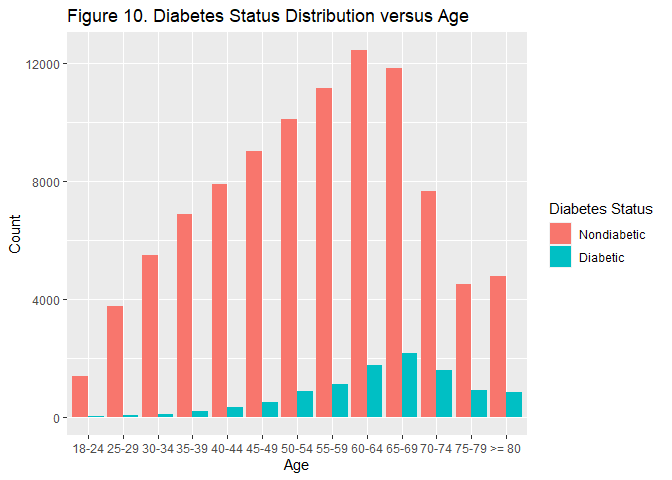

Project 3: Modelling of Diabetes Data for Patients with Education =
College Graduate
================
Yvette Callender
2023-12-09

- [Introduction](#introduction)
  - [Data](#data)
  - [Variables](#variables)
  - [Purpose of EDA and Modeling and End
    Results](#purpose-of-eda-and-modeling-and-end-results)
- [Data Set-Up](#data-set-up)
- [Summarizations for Education = College
  Graduate](#summarizations-for-education--college-graduate)
  - [Response Variable:
    `Diabetes_binary`](#response-variable-diabetes_binary)
  - [Predictor variable: `HighBP`](#predictor-variable-highbp)
  - [Predictor variable: `HighChol`](#predictor-variable-highchol)
  - [Predictor variable: `BMI`](#predictor-variable-bmi)
  - [Predictor variable:
    `HeartDiseaseorAttack`](#predictor-variable-heartdiseaseorattack)
  - [Predictor variable: `GenHlth`](#predictor-variable-genhlth)
  - [Predictor variable: `DiffWalk`](#predictor-variable-diffwalk)
  - [Predictor variable: `Age`](#predictor-variable-age)
- [Modeling](#modeling)
  - [Split Data Into Training and
    Test](#split-data-into-training-and-test)
  - [Log Loss Function](#log-loss-function)
  - [Logistic Regression](#logistic-regression)
    - [Description](#description)
    - [Model 1](#model-1)
    - [Model 2](#model-2)
    - [Model 3](#model-3)
    - [Selection of Best Model](#selection-of-best-model)
  - [LASSO Logistic Regression](#lasso-logistic-regression)
    - [Description](#description-1)
    - [Model](#model)
  - [Classification Tree Model](#classification-tree-model)
    - [Description](#description-2)
    - [Model](#model-4)
  - [Random Forest Model](#random-forest-model)
    - [Description](#description-3)
    - [Model](#model-5)
  - [Ridge Logistic Regression](#ridge-logistic-regression)
    - [Description](#description-4)
    - [Model](#model-6)
  - [Elastic Net Logistic Regression](#elastic-net-logistic-regression)
    - [Description](#description-5)
    - [Model](#model-7)
  - [Final Model Comparison using Log Loss from Cross
    Validation](#final-model-comparison-using-log-loss-from-cross-validation)
- [Applying Models to Test Set](#applying-models-to-test-set)
  - [Logistic Regression](#logistic-regression-1)
  - [LASSO Regression](#lasso-regression)
  - [Classification Tree](#classification-tree)
  - [Random Forest](#random-forest)
  - [Ridge Regression](#ridge-regression)
  - [Elastic Net Regression](#elastic-net-regression)
  - [“Pick the Most Popular” Model](#pick-the-most-popular-model)
  - [Selection of Best Model Based on Performance with Test
    Set](#selection-of-best-model-based-on-performance-with-test-set)
- [Summary](#summary)

<script type="text/javascript" id="MathJax-script" async
  src="https://cdn.jsdelivr.net/npm/mathjax@3/es5/tex-mml-chtml.js">
</script>

``` r
knitr::opts_chunk$set(echo = TRUE, fig.path=paste0('Figs/', params$Education_Level, '/'), warning = FALSE, message = FALSE)
```

``` r
EducationLevel <- c("Elementary", "Some High School","High School Graduate", "Some College or Technical School", "College Graduate")

output_file <- paste0(EducationLevel, "_Analysis.md")

params = lapply(EducationLevel, FUN = function(x){list(EducationLevel = x)})
reports <- tibble(output_file, params)
apply(reports, MARGIN= 1, FUN = function(x){rmarkdown::render(input="Project 3.Rmd", output_file=x[[1]], params = x[[2]])})
```

The following libraries were used in this project.

``` r
library(tidyverse)
library(caret)
```

# Introduction

In this project, data related to diabetes health was analyzed using a
variety of models.

## Data

A Diabetes Health Indicators Dataset:
`diabetes_binary_health_indicators_BRFSS2015.csv` was used for this
project. This dataset can be found online [on
Kaggle](https://www.kaggle.com/code/jerryodegua/eda-prediction-of-diabetes-data)
along with descriptions of the variables.

## Variables

The dataset contains 21 variables than can potentially be used in the
analysis. A subset was chosen and they are described below.

The variable `diabetes_binary` is the response variable for this
analysis. It is either a 0 (corresponding to a lack of either
prediabetes or diabetes) or a 1 (corresponding to the presence of either
prediabetes or diabetes).

The variable `HighBP` is a binary variable with 1 corresponding to high
blood pressure and 0 corresponding to normal blood pressure.

The variable `HighChol` is a binary variable with 1 corresponding to
high cholesterol levels and 0 corresponding to normal cholesterol
levels.

The variable `BMI` (Body Mass Index) is a numeric variable. As part of
the analysis, it was converted to a categorical variable with values
corresponding to underweight (BMI $\le$ 18.5), normal(18.5 $\le$ BMI
$\le$ 24.9), overweight(25.0 $\le$ BMI $\le$ 29.9) and obese(30 $\le$
BMI).

The variable `HeartDiseaseorAttack` is a binary variable where 1
indicates a history of heart disease or attack and a 0 indicates a lack
thereof.

The variable `GenHlth` is a categorical variable describing the the
reported level of general health as described below:

| Level | Description |
|:------|:-----------:|
| 1     |  excellent  |
| 2     |  very good  |
| 3     |    good     |
| 4     |    fair     |
| 5     |    poor     |

The variable `DiffWalk` is a binary variable with 1 corresponding to
reported difficulty walking or climbing stairs and 0 corresponding to no
reported difficulty walking or climbing stairs.

The variable `Age` is a categorical variable with the following levels.

| Level |    Description     |
|:------|:------------------:|
| 1     |  18-24 years old   |
| 2     |  25-29 years old   |
| 3     |  30-34 years old   |
| 4     |  35-39 years old   |
| 5     |  40-44 years old   |
| 6     |  45-54 years old   |
| 7     |  50-54 years old   |
| 8     |  55-59 years old   |
| 9     |  60-64 years old   |
| 10    |  65-69 years old   |
| 11    |  70-74 years old   |
| 12    |  75-79 years old   |
| 13    | $\ge$ 80 years old |

The variable `Education` is a categorical variable with the following
levels.

| Education Level |                         Description                          |
|:----------------|:------------------------------------------------------------:|
| 1               |          Never attended school or only kindergarten          |
| 2               |               Grades 1 through 8 (Elementary)                |
| 3               |                Grades 9-11 (Some high school)                |
| 4               |            Grade 12 or GED (High school graduate)            |
| 5               | College 1 year to 3 years (Some college or technical school) |
| 6               |          College 4 years or more (College graduate)          |

For this analysis, data was divided into subsets based on the value of
`Education`. There are five subsets: one for levels one and two
combined, and one each for levels three, four, five, and six.

## Purpose of EDA and Modeling and End Results

The relationship between the presence of diabetes/prediabetes (as
indicated by `diabetes_binary`) and the predictor variables (`HighBP`,
`HighChol`, `BMI` , `HeartDiseaseorAttack`, `GenHlth`, `DiffWalk`, and
`Age`) were explored at several levels of education, one of which
(College Graduate) is reported here. After Exploratory Data Analysis,
the relationships were modeled using a variety or approaches (logistic
regression, LASSO logistic regression, classification tree, random
forest, ridge, and elastic net), and a best model was chosen for the
level of education.

# Data Set-Up

Data was imported and converted to a tibble. Columns corresponding to
categorical variables were converted to factors.

``` r
#Read in Data
diabetes_data <- read.csv ("diabetes_binary_health_indicators_BRFSS2015.csv") %>% 
                 as_tibble


#Select Desired Columns
diabetes_data <- diabetes_data %>%
    select(Diabetes_binary, HighBP, HighChol, BMI, HeartDiseaseorAttack, GenHlth,
           DiffWalk, Age, Education)

#For education make a new column where 1 and 2 are combined
diabetes_data$EducationDerived <- ifelse(diabetes_data$Education == 1 |
                                         diabetes_data$Education == 2 , '1_and_2',
                                         diabetes_data$Education)

#Convert EducationDerived to factor with labels
diabetes_data$EducationDerived <- factor(diabetes_data$EducationDerived, 
                                            levels = c('1_and_2', '3','4','5','6'), 
                                            labels = c("Elementary", 
                                                       "Some High School",
                                                       "High School Graduate", 
                                                       "Some College or Technical School",
                                                       "College Graduate"))

#Convert of binary variable to factors
diabetes_data <- diabetes_data %>% 
    mutate(Diabetes_binary = factor(Diabetes_binary, levels = c("0","1"), 
        labels = c("Nondiabetic", "Diabetic"))) %>%
    mutate(HighBP = factor(HighBP, levels = c("0","1"), 
        labels = c("Normal BP", "High BP"))) %>%
    mutate(HighChol = factor(HighChol, levels = c("0","1"), 
        labels = c("Normal Cholesterol", "High Cholesterol"))) %>%
    mutate(HeartDiseaseorAttack = factor(HeartDiseaseorAttack, levels = c("0","1"), 
        labels = c("No History", "History of Heart Disease or Attack"))) %>%
    mutate(DiffWalk = factor(DiffWalk, levels = c("0","1"), 
        labels = c("No Difficulty Walking or Climbing Stairs", 
                   "Difficulty Walking or Climbing Stairs"))) 

#Convert BMI to ordered factors
diabetes_data <- diabetes_data %>% 
    mutate(BMIFactor = if_else (BMI <= 18.5, "Underweight",
                                if_else (BMI <= 24.9, "Healthy",
                                    if_else (BMI <= 29.9, "Overweight", "Obese"))))
diabetes_data$BMIFactor <- ordered(diabetes_data$BMIFactor, 
                                   levels = c("Underweight","Healthy","Overweight","Obese"))

#Convert age to factors 
diabetes_data <- diabetes_data %>% 
    mutate(Age = factor(Age, 
        levels =  c("1","2","3","4","5","6","7","8","9","10", "11", "12", "13"), 
                 labels = c("18-24", "25-29", "30-34", "35-39", "40-44", "45-49", "50-54",
                          "55-59", "60-64", "65-69", "70-74", "75-79", ">= 80" ))) 

# Convert GenHlth to factors
diabetes_data <- diabetes_data %>% 
    mutate(GenHlth = factor(GenHlth, 
        levels =  c("1","2","3","4","5"), 
                 labels = c("Excellent", "Very good", "Good", "Fair", "Poor")))
```

Data was filtered for the desired education level.

``` r
diabetes_data_subset <- diabetes_data %>% 
    filter(EducationDerived == params$EducationLevel)
```

# Summarizations for Education = College Graduate

## Response Variable: `Diabetes_binary`

The amounts of nondiabetics and diabetics in this dataset are:

``` r
#Make and print table
table1 <- table(diabetes_data_subset$Diabetes_binary)
knitr::kable(table1, col.names = c("Diabetes Status", "Frequency"))
```

| Diabetes Status | Frequency |
|:----------------|----------:|
| Nondiabetic     |     96925 |
| Diabetic        |     10400 |

There are 9.3X as many nondiabetics as diabetics in the dataset at
Education = College Graduate.

This can be seen graphically here.

``` r
#Base layer
figure1 <- ggplot(diabetes_data_subset, aes(x = Diabetes_binary))
#Build up
figure1 + geom_bar() +
    labs( x = "Diabetes Status",
          y = "Count",
          title = "Figure 1. Diabetes Status Distribution")
```

<!-- -->

## Predictor variable: `HighBP`

The distribution in this dataset for high blood pressure is:

``` r
#Make and print table
table2 <- table(diabetes_data_subset$HighBP)
knitr::kable(table2, col.names = c("Blood Pressure", "Frequency"))
```

| Blood Pressure | Frequency |
|:---------------|----------:|
| Normal BP      |     69087 |
| High BP        |     38238 |

The distribution for diabetes status in this dataset as a function of
blood pressure status is:

``` r
#Make and print table
table3 <- table(diabetes_data_subset$Diabetes_binary,diabetes_data_subset$HighBP)
knitr::kable(table3)
```

|             | Normal BP | High BP |
|:------------|----------:|--------:|
| Nondiabetic |     66157 |   30768 |
| Diabetic    |      2930 |    7470 |

This can be seen graphically here.

``` r
#Base layer
figure2 <- ggplot(diabetes_data_subset, aes(x = Diabetes_binary))
#Build up
figure2 + geom_bar(aes(fill = HighBP)) +
    labs( x = "Diabetes Status",
          y = "Count",
          title = "Figure 2. Diabetes Status Distribution versus Blood Pressure Status") +
    guides(fill = guide_legend(title = "Blood Pressure"))
```

<!-- -->

## Predictor variable: `HighChol`

The distribution in this dataset for high cholesterol is:

``` r
#Make and print table
table4 <- table(diabetes_data_subset$HighChol)
knitr::kable(table4, col.names = c("Cholesterol", "Frequency"))
```

| Cholesterol        | Frequency |
|:-------------------|----------:|
| Normal Cholesterol |     65371 |
| High Cholesterol   |     41954 |

The distribution for diabetes status in this dataset as a function of
cholesterol status is:

``` r
#Make and print table
table5 <- table(diabetes_data_subset$Diabetes_binary,diabetes_data_subset$HighChol)
knitr::kable(table5)
```

|             | Normal Cholesterol | High Cholesterol |
|:------------|-------------------:|-----------------:|
| Nondiabetic |              61767 |            35158 |
| Diabetic    |               3604 |             6796 |

This can be seen graphically here.

``` r
#Base layer
figure3 <- ggplot(diabetes_data_subset, aes(x = Diabetes_binary))
#Build up
figure3 + geom_bar(aes(fill = HighChol)) +
    labs( x = "Diabetes Status",
          y = "Count",
          title = "Figure 3. Diabetes Status Distribution versus Cholesterol Status") +
    guides(fill = guide_legend(title = "Cholesterol"))
```

<!-- -->

## Predictor variable: `BMI`

The distribution in this dataset for BMI as a numeric value is
summarized here:

``` r
#Make and print table
table6 <- diabetes_data_subset %>% 
    summarize (Variable = "BMI",
               Minimum = min(BMI),
               Median = median(BMI),
               Maximum = max(BMI),
               Mean = round(mean (BMI),1),
               StdDev = round(sd(BMI),1)
              )
knitr::kable(table6)
```

| Variable | Minimum | Median | Maximum | Mean | StdDev |
|:---------|--------:|-------:|--------:|-----:|-------:|
| BMI      |      12 |     27 |      98 | 27.5 |    6.2 |

This can be visualized as a boxplot:

``` r
figure4<-ggplot() +
         geom_boxplot(aes (y = diabetes_data_subset$BMI))+
         labs (y = "BMI",
               title = "Figure 4. Boxplot for BMI")+
         theme(axis.title.x = element_blank(),
               axis.text.x = element_blank(),
               axis.ticks.x = element_blank())
figure4
```

<!-- -->

Based on [Center for Diseased Control
guidelines](https://www.cdc.gov/healthyweight/assessing/bmi/adult_bmi/index.html),
the variable `BMIFactor` was set to underweight, healthy, overweight, or
obese. The distribution with regard to `BMIFactor` at Education =
College Graduate is shown here.

``` r
#Base layer
figure5 <- ggplot(diabetes_data_subset, aes(x = BMIFactor)) 
#Build up
figure5 + geom_bar() +
    labs( x = "BMI Classification",
          y = "Count",
          title = "Figure 5. BMI Classification Distribution")
```

<!-- -->

The effect of BMI on the relative amounts of nondiabetics versus
diabetics is shown here.

``` r
#Base layer
figure6 <- ggplot(diabetes_data_subset, aes(x = BMIFactor))
#Build up
figure6 + geom_bar(aes(fill = Diabetes_binary), position = "dodge") +
    labs( x = "BMI Classification",
          y = "Count",
          title = "Figure 6. Diabetes Status Distribution versus BMI") +
    guides(fill = guide_legend(title = "Diabetes Status"))
```

<!-- -->

## Predictor variable: `HeartDiseaseorAttack`

The distribution in this dataset for a history of heart disease or
attack is:

``` r
#Make and print table
table7 <- table(diabetes_data_subset$HeartDiseaseorAttack)
knitr::kable(table7, col.names = c("History of Heart Trouble", "Frequency"))
```

| History of Heart Trouble           | Frequency |
|:-----------------------------------|----------:|
| No History                         |    100242 |
| History of Heart Disease or Attack |      7083 |

The distribution for diabetes status in this dataset as a function of
whether the subject has a history of heart disease or attack is:

``` r
#Make and print table
table8 <- table(diabetes_data_subset$Diabetes_binary,diabetes_data_subset$HeartDiseaseorAttack)
knitr::kable(table8)
```

|             | No History | History of Heart Disease or Attack |
|:------------|-----------:|-----------------------------------:|
| Nondiabetic |      91849 |                               5076 |
| Diabetic    |       8393 |                               2007 |

This can be seen graphically here.

``` r
#Base layer
figure7 <- ggplot(diabetes_data_subset, aes(x = Diabetes_binary))
#Build up
figure7 + geom_bar(aes(fill = HeartDiseaseorAttack)) +
    labs( x = "Diabetes Status",
          y = "Count",
          title = "Figure 7. Diabetes Status Distribution versus History of Heart Disease or Attack") +
    guides(fill = guide_legend(title = "History of Heart Trouble"))
```

<!-- -->

## Predictor variable: `GenHlth`

The distribution in this dataset for the subject’s description of their
general health is:

``` r
#Make and print table
table9 <- table(diabetes_data_subset$GenHlth)
knitr::kable(table9, col.names = c("Subject Description of General Health", "Frequency"))
```

| Subject Description of General Health | Frequency |
|:--------------------------------------|----------:|
| Excellent                             |     26486 |
| Very good                             |     44106 |
| Good                                  |     27094 |
| Fair                                  |      7420 |
| Poor                                  |      2219 |

The distribution for diabetes status in this dataset as a function of
the subject’s description of their general health is:

``` r
#Make and print table
table10 <- table(diabetes_data_subset$Diabetes_binary,diabetes_data_subset$GenHlth)
knitr::kable(table10)
```

|             | Excellent | Very good |  Good | Fair | Poor |
|:------------|----------:|----------:|------:|-----:|-----:|
| Nondiabetic |     26023 |     41480 | 22751 | 5274 | 1397 |
| Diabetic    |       463 |      2626 |  4343 | 2146 |  822 |

This can be seen graphically here.

``` r
#Base layer
figure8 <- ggplot(diabetes_data_subset, aes(x = GenHlth))
#Build up
figure8 + geom_bar(aes(fill = Diabetes_binary), position = "dodge") +
    labs( x = "General Health of Subject",
          y = "Count",
          title = "Figure 8. Diabetes Status Distribution versus General Health")+
    guides(fill = guide_legend(title = "Diabetes Status"))
```

<!-- -->

## Predictor variable: `DiffWalk`

The distribution in this dataset for a whether the subject reports
difficulty walking or climbing stairs is:

``` r
#Make and print table
table11 <- table(diabetes_data_subset$DiffWalk)
knitr::kable(table11, col.names = c(" ", "Frequency"))
```

|                                          | Frequency |
|:-----------------------------------------|----------:|
| No Difficulty Walking or Climbing Stairs |     97035 |
| Difficulty Walking or Climbing Stairs    |     10290 |

The distribution for diabetes status in this dataset as a function of
whether the subject reports difficulty walking or climbing stairs is:

``` r
#Make and print table
table12 <- table(diabetes_data_subset$Diabetes_binary,diabetes_data_subset$DiffWalk)
knitr::kable(table12)
```

|             | No Difficulty Walking or Climbing Stairs | Difficulty Walking or Climbing Stairs |
|:------------|-----------------------------------------:|--------------------------------------:|
| Nondiabetic |                                    89388 |                                  7537 |
| Diabetic    |                                     7647 |                                  2753 |

This can be seen graphically here.

``` r
#Base layer
figure9 <- ggplot(diabetes_data_subset, aes(x = Diabetes_binary))
#Build up
figure9 + geom_bar(aes(fill = DiffWalk), position = "dodge") +
    labs( x = "Diabetes Status",
          y = "Count",
          title = "Figure 9. Diabetes Status Distribution versus Difficulty Walking or Climbing Stairs") +
      guides(fill = guide_legend(title = " "))
```

<!-- -->

## Predictor variable: `Age`

The distribution in this dataset for age is:

``` r
#Make and print table
table13 <- table(diabetes_data_subset$Age) 
knitr::kable(table13, col.names = c("Age Range ", "Frequency"))
```

| Age Range | Frequency |
|:----------|----------:|
| 18-24     |      1386 |
| 25-29     |      3806 |
| 30-34     |      5607 |
| 35-39     |      7042 |
| 40-44     |      8242 |
| 45-49     |      9515 |
| 50-54     |     10982 |
| 55-59     |     12291 |
| 60-64     |     14175 |
| 65-69     |     14013 |
| 70-74     |      9235 |
| 75-79     |      5421 |
| \>= 80    |      5610 |

The distribution for diabetes status in this dataset as a function of
age is:

``` r
#Make and print table
table14 <- table(diabetes_data_subset$Diabetes_binary,diabetes_data_subset$Age)
knitr::kable(table14)
```

|             | 18-24 | 25-29 | 30-34 | 35-39 | 40-44 | 45-49 | 50-54 | 55-59 | 60-64 | 65-69 | 70-74 | 75-79 | \>= 80 |
|:------------|------:|------:|------:|------:|------:|------:|------:|------:|------:|------:|------:|------:|-------:|
| Nondiabetic |  1371 |  3766 |  5504 |  6863 |  7905 |  9029 | 10100 | 11171 | 12433 | 11850 |  7648 |  4516 |   4769 |
| Diabetic    |    15 |    40 |   103 |   179 |   337 |   486 |   882 |  1120 |  1742 |  2163 |  1587 |   905 |    841 |

This can be seen graphically here.

``` r
#Base layer
figure10 <- ggplot(diabetes_data_subset, aes(x = Age))
#Build up
figure10 + geom_bar(aes(fill = Diabetes_binary), position = "dodge") +
    labs( x = "Age",
          y = "Count",
          title = "Figure 10. Diabetes Status Distribution versus Age") +
    guides(fill = guide_legend(title = "Diabetes Status "))
```

<!-- -->

# Modeling

## Split Data Into Training and Test

The `createDataPartition` from `caret` was used to partition the data
into training (70% of the data) and test (30% of the data) sets.
Diabetics and non-diabetics were split separately.

``` r
#for reproducibility
set.seed(1331)

#generate indices for split 
trainIndex <-createDataPartition(diabetes_data_subset$Diabetes_binary, p =0.7, list=FALSE)

#split data
diabetes_data_subset_train <- diabetes_data_subset[trainIndex,]
diabetes_data_subset_test <- diabetes_data_subset[-trainIndex,]
```

## Log Loss Function

[Reference](https://www.youtube.com/watch?v=MztgenIfGgM)

Logarithmic loss (or log loss or cross-entropy loss) is a performance
measure for a binary classification model which outputs a probability
between 0 and 1. Values for log loss can range from 0 to $$\infty$$
infinity, with 0 representing a perfect model. The equation for
determining Log Loss is:

$$ LogLoss = -\frac{1}{N}\sum_{i=1}^{N} (y_ilog(p(y_i))+(1-y_i)log (1-p(y_i)) $$

It has a desirable feature of being convex and having a single global
minimum. This is in contrast to the MSE (mean square error) function
used in linear regression which is not convex and can have many local
minima, which makes it unsuitable for use in logistic regression.

When accuracy is used as a performance measure, it only takes right and
wrong into account; whereas the log loss function has weighting terms
that take into account just how wrong the model is. While accuracy would
treat probabilities of 0.05 and 0.45 for a true “1” as equally wrong,
log loss would impose a much higher penalty (3.8 X greater) on the
confident but wrong p=0.05.

Log loss analysis can be incorporated into `caret` by setting the
`metric = logloss` and using `summaryFunction = mnLogLoss` in
`trControl`.

## Logistic Regression

[Reference](https://www.youtube.com/watch?v=MztgenIfGgM)

### Description

Logistic Regression is a method used on dataset where the response
(dependent) variable is binary. The response variable is fit as a
logistic sigmoid function of independent variables which can be
continuous or binary. The general form of the equation is

$$ y= \frac{1}{1+e^{-X}}$$

where X is a vector containing all the predictor variables. The range of
this function is 0-1, which works well with a binary dependent
variable.  
The logistic function is linked to the X vector with the logit function.

$$log\frac{p}{1-p}=\beta_0 + \beta_1x_1 + \beta_2x_2+ ...+ \beta_px_p$$

### Model 1

The first candidate logistic regression model includes all the following
variables:
`HighBP`,`HighChol`,`BMIFactor`,`HeartDiseaseorAttack`,`GenHlth`,`DiffWalk`,
and `Age`.

This
[reference](https://machinelearningmastery.com/machine-learning-evaluation-metrics-in-r/)
was used for incorporating log loss into `trControl` and `train`.

``` r
#Set up formula
outcome <- "Diabetes_binary"
variables <- c('HighBP','HighChol','BMIFactor','HeartDiseaseorAttack','GenHlth','DiffWalk','Age')
formula_logistic_1 <- as.formula(paste (outcome, 
                                        paste(variables, collapse = " + "), 
                                        sep = " ~ "))
formula_logistic_1
```

    ## Diabetes_binary ~ HighBP + HighChol + BMIFactor + HeartDiseaseorAttack + 
    ##     GenHlth + DiffWalk + Age
    ## <environment: 0x0000026d56da7da8>

``` r
#for reproducibility
set.seed(1331)

#Perform fit using logLoss with 5 fold cross validation
fit_logistic_1 <- train(formula_logistic_1,
                        data = diabetes_data_subset_train,
                        method = "glm",
                        family = "binomial",
                        trControl = trainControl(method = "cv", number = 5,
                                                 classProbs = TRUE, 
                                                 summaryFunction = mnLogLoss),
                        metric = "logLoss"
                        )

knitr::kable(fit_logistic_1[[4]][2], digits = 4, align = "l")
```

| logLoss |
|:--------|
| 0.2479  |

### Model 2

The second candidate logistic regression model includes all the
following variables:
`HighBP`,`HighChol`,`BMIFactor`,`HeartDiseaseorAttack`,`GenHlth`,and
`DiffWalk`.

``` r
#Set up formula
outcome <- "Diabetes_binary"
variables <- c('HighBP','HighChol','BMIFactor','HeartDiseaseorAttack','GenHlth','DiffWalk')
formula_logistic_2 <- as.formula(paste (outcome, 
                                        paste(variables, collapse = " + "), 
                                        sep = " ~ "))
formula_logistic_2
```

    ## Diabetes_binary ~ HighBP + HighChol + BMIFactor + HeartDiseaseorAttack + 
    ##     GenHlth + DiffWalk
    ## <environment: 0x0000026d56da7da8>

``` r
#for reproducibility
set.seed(1331)

#Perform fit using logLoss with 5 fold cross validation
fit_logistic_2 <- train(formula_logistic_2,
                        data = diabetes_data_subset_train,
                        method = "glm",
                        family = "binomial",
                        trControl = trainControl(method = "cv", number = 5,
                                                 classProbs = TRUE, 
                                                 summaryFunction = mnLogLoss),
                        metric = "logLoss"
                        )

knitr::kable(fit_logistic_2[[4]][2], digits = 4, align = "l")
```

| logLoss |
|:--------|
| 0.2536  |

### Model 3

The third candidate logistic regression model includes all the following
variables: `HighBP`,`HighChol`,`BMIFactor`, and `HeartDiseaseorAttack`.

``` r
#Set up formula
outcome <- "Diabetes_binary"
variables <- c('HighBP','HighChol','BMIFactor','GenHlth')
formula_logistic_3 <- as.formula(paste (outcome, 
                                        paste(variables, collapse = " + "), 
                                        sep = " ~ "))
formula_logistic_3
```

    ## Diabetes_binary ~ HighBP + HighChol + BMIFactor + GenHlth
    ## <environment: 0x0000026d56da7da8>

``` r
#for reproducibility
set.seed(1331)

#Perform fit using logLoss with 5 fold cross validation
fit_logistic_3 <- train(formula_logistic_3,
                        data = diabetes_data_subset_train,
                        method = "glm",
                        family = "binomial",
                        trControl = trainControl(method = "cv", number = 5,
                                                 classProbs = TRUE, 
                                                 summaryFunction = mnLogLoss),
                        metric = "logLoss"
                        )

knitr::kable(fit_logistic_3[[4]][2], digits = 4, align = "l")
```

| logLoss |
|:--------|
| 0.2551  |

### Selection of Best Model

``` r
#Use if else statements to select logistic model with lowest Log Loss
if (fit_logistic_1[[4]][2]<fit_logistic_2[[4]][2]  &
    fit_logistic_1[[4]][2]<fit_logistic_3[[4]][2]) {
    fit_logistic <-fit_logistic_1
    } else if (fit_logistic_2[[4]][2]<fit_logistic_3[[4]][2]) {
          fit_logistic <-fit_logistic_2
          } else {fit_logistic <-fit_logistic_3}

# Store method and logloss to facilitate comparison
logistic_results <- as_tibble(fit_logistic[[4]][2]) %>% 
    mutate (Method = "Logistic") %>%
    select (Method, logLoss)

knitr::kable(logistic_results, digits = 4, align = 'll')
```

| Method   | logLoss |
|:---------|:--------|
| Logistic | 0.2479  |

## LASSO Logistic Regression

[Reference](https://www.mygreatlearning.com/blog/understanding-of-lasso-regression/)

### Description

Least Absolute Shrinkage and Selection Operator (LASSO) is a penalized
method for modelling. It is used in an attempt to balance accuracy and
simplicity. The penalty (assuming n predictor variables) is calculated
as $$L_1 = \lambda * (|\beta_1| + |\beta_2| + ... + |\beta_n|)$$

$$\lambda$$ is a tuning parameter. Larger values of $$\lambda$$ push
more coefficients to zero- leading to sparser models, while smaller
values of $$\lambda$$ allow more non-zero coefficients- corresponding to
more complex models.

During the modelling the function that is minimized- referred to as the
objective function- is the sum of the penalty function and the cost
function (which for this logistic regression will be log loss).

$$Objective Function = Log Loss + L_1 = Log Loss + \lambda * (|\beta_1| + |\beta_2| + ... + |\beta_n|)$$

### Model

``` r
#Set up formula
outcome <- "Diabetes_binary"
variables <- c('HighBP','HighChol','BMIFactor','HeartDiseaseorAttack','GenHlth','DiffWalk', 'Age')
formula_lasso <- as.formula(paste (outcome, 
                                   paste(variables, collapse = " + "), 
                                   sep = " ~ "))
formula_lasso
```

    ## Diabetes_binary ~ HighBP + HighChol + BMIFactor + HeartDiseaseorAttack + 
    ##     GenHlth + DiffWalk + Age
    ## <environment: 0x0000026d56da7da8>

``` r
#Set up lambdas parameter for tuneGrid
lambdas <- 10^seq(0, -4, by = -.1)

#for reproducibility
set.seed(1331)

#Perform fit using logLoss with 5 fold cross validation
fit_lasso <- train(formula_lasso,
                   data = diabetes_data_subset_train,
                   method = "glmnet",
                   family = "binomial",
                   trControl = trainControl(method = "cv", number = 5,
                                            classProbs = TRUE,               
                                            summaryFunction = mnLogLoss),
                   metric = "logLoss",
                   tuneGrid = expand.grid (alpha = 1, lambda = lambdas)
                   )

#Best lambda after tuning
fit_lasso$bestTune$lambda
```

    ## [1] 0.0001258925

``` r
#Extract logLoss and store with method to facilitate comparison
lasso_results <- fit_lasso[[4]] %>% 
    filter(lambda == fit_lasso$bestTune$lambda) %>%
    mutate(Method = "LASSO") %>%
    select(Method, logLoss)

knitr::kable(lasso_results,digits = 4, align = "ll")
```

| Method | logLoss |
|:-------|:--------|
| LASSO  | 0.248   |

## Classification Tree Model

### Description

Classification trees involve splitting the predictor space into regions,
and predictions are made based on the regions- usually the most
prevalent class is used as the prediction. Strengths of classifications
trees include ease of understanding and interpretability, the fact that
predictors do not require scaling, that no statistical assumptions are
necessary, and that variable selection is built in. Weaknesses include
sensitivity to small changes in the data, a need for a greedy algorithm,
and a need for pruning.

### Model

``` r
#Set up formula
outcome <- "Diabetes_binary"
variables <- c('HighBP','HighChol','BMIFactor','HeartDiseaseorAttack','GenHlth','DiffWalk', 'Age')
formula_classification_tree <- as.formula(paste (outcome, 
                                                 paste(variables, collapse = " + "), 
                                                 sep = " ~ "))
formula_classification_tree
```

    ## Diabetes_binary ~ HighBP + HighChol + BMIFactor + HeartDiseaseorAttack + 
    ##     GenHlth + DiffWalk + Age
    ## <environment: 0x0000026d56da7da8>

``` r
#Set up complexity parameter for tuneGrid
cps <- seq(0,0.2, by = 0.005)

#for reproducibility
set.seed(1331)

#Perform fit using logLoss with 5 fold cross validation
fit_classification_tree <- train(formula_classification_tree,
                                 data = diabetes_data_subset_train,
                                 method = "rpart",
                                 trControl = trainControl(method = "cv", number = 5,
                                                          classProbs = TRUE,               
                                                          summaryFunction = mnLogLoss),
                                 metric = "logLoss",
                                 tuneGrid = data.frame (cp = cps)
                                 )

#Best complexity parameter from tuning
fit_classification_tree$bestTune$cp
```

    ## [1] 0

``` r
#Extract logLoss and store with method to facilitate comparison
classification_tree_results <- fit_classification_tree[[4]] %>% 
    filter(cp == fit_classification_tree$bestTune$cp) %>%
    mutate(Method = "Classification Tree") %>%
    select(Method, logLoss)

knitr::kable(classification_tree_results, digits = 4, align = "ll")
```

| Method              | logLoss |
|:--------------------|:--------|
| Classification Tree | 0.2651  |

## Random Forest Model

[Reference](https://www.ibm.com/topics/random-forest)

### Description

Random forest is a tree-based method of modeling. It uses multiple
decision trees to arrive at a single result. It uses bootstrap/
aggregating (bagging) and feature randomness to “create an uncorrelated
forest of decision trees”. It is the feature randomness that
distinguishes the random forest model from the classification tree.
There are three parameters that control the random forest model: node
size, number of trees, and number of features sampled.

While classification trees are prone to overfitting the data (making it
conform too tightly to the training set), that risk is reduced in a
random forest model due to the averaging of results from uncorrelated
trees. Another advantage of random forest over classification trees is
that it is easier to evaluate the importance of different predictor
variables.

In `caret`, `mtry`is a tuning parameter for the number of variables. A
general guideline is to tune up to the square root of the number of
parameters. Here, the number of parameters corresponds to a summation
across the parameters of number of levels-1.

$$Parameter = (2-1) + (2-1) +(4-1) + (2-1) + (5-1) + (2-1) + (13-1) = 23$$

So the maximum value for `mtry` was set to 5.

### Model

``` r
#Set up formula
outcome <- "Diabetes_binary"
variables <- c('HighBP','HighChol','BMIFactor','HeartDiseaseorAttack','GenHlth','DiffWalk', 'Age')
formula_random_forest <- as.formula(paste (outcome, 
                                           paste(variables, collapse = " + "), 
                                           sep = " ~ "))
formula_random_forest
```

    ## Diabetes_binary ~ HighBP + HighChol + BMIFactor + HeartDiseaseorAttack + 
    ##     GenHlth + DiffWalk + Age
    ## <environment: 0x0000026d4e118938>

``` r
#Set up mtrys for tuneGrid
mtrys <- seq(2, 5, by = 1)


#for reproducibility
set.seed(1331)

#Perform fit using logLoss with 5 fold cross validation
fit_random_forest <- train(formula_random_forest,
                           data = diabetes_data_subset_train,
                           method = "rf",
                           trControl = trainControl(method = "cv", number = 5,
                                                    classProbs = TRUE,               
                                                    summaryFunction = mnLogLoss),
                           metric = "logLoss",
                           tuneGrid = expand.grid (mtry = mtrys),
                           ntree=100
                           )

#Best tuning parameter 
fit_random_forest$bestTune$mtry
```

    ## [1] 4

``` r
#Extract logLoss and store with method to facilitate comparison
random_forest_results <- fit_random_forest[[4]] %>% 
    filter(mtry == fit_random_forest$bestTune$mtry) %>%
    mutate(Method = "Random Forest") %>%
    select(Method, logLoss)

knitr::kable(random_forest_results, digits = 4, align = "ll")
```

| Method        | logLoss |
|:--------------|:--------|
| Random Forest | 1.0002  |

## Ridge Logistic Regression

[Reference](https://www.cvxpy.org/examples/machine_learning/ridge_regression.html)

### Description

Ridge logistic regression is a penalized method for modelling. It is
used in an attempt to balance accuracy and simplicity. The penalty
(assuming n predictor variables) is calculated as

$$L_2 = \frac{\lambda}{2} * (\beta_1^2 + \beta_2^2 + ... + \beta_n^2)$$

$$\lambda$$ is a complexity parameter. Larger values of $$\lambda$$ push
more coefficients toward zero, while smaller values of $$\lambda$$ allow
coefficients to remain larger. In ridge regression, coefficients will
never be pushed all the way to zero.

During the modelling the function that is minimized- referred to as the
objective function- is the sum of the penalty function and the cost
function (which for this logistic regression will be log loss).

$$Objective Function = Log Loss + L_2 = Log Loss + \frac{\lambda}{2} * (\beta_1^2 + \beta_2^2 + ... + \beta_n^2)$$

Because L<sub>2</sub> does not include an intercept term, it is
necessary to standardize numeric predictor variables appropriately.
Since all the variables here are categorical, no pre-processing is
necessary.

### Model

``` r
#Set up formula
outcome <- "Diabetes_binary"
variables <- c('HighBP','HighChol','BMIFactor','HeartDiseaseorAttack','GenHlth','DiffWalk', 'Age')
formula_ridge <- as.formula(paste (outcome, 
                                   paste(variables, collapse = " + "), 
                                   sep = " ~ "))
formula_ridge
```

    ## Diabetes_binary ~ HighBP + HighChol + BMIFactor + HeartDiseaseorAttack + 
    ##     GenHlth + DiffWalk + Age
    ## <environment: 0x0000026d4e118938>

``` r
#Set up lambdas parameter for tuneGrid
lambdas <- 10^seq(0, -4,by = -.1)

#for reproducibility
set.seed(1331)

#Perform fit using logLoss with 5 fold cross validation
fit_ridge <- train(formula_ridge,
                   data = diabetes_data_subset_train,
                   method = "glmnet",
                   family = "binomial",
                   trControl = trainControl(method = "cv", number = 5,
                                            classProbs = TRUE,               
                                            summaryFunction = mnLogLoss),
                   metric = "logLoss",
                   tuneGrid = expand.grid (alpha = 0, lambda = lambdas)
                   )

#Best lambda after tuning
fit_ridge$bestTune$lambda
```

    ## [1] 0.01995262

``` r
#Extract logLoss and store with method to facilitate comparison
ridge_results <- fit_ridge[[4]] %>% 
    filter(lambda == fit_ridge$bestTune$lambda) %>%
    mutate(Method = "Ridge") %>%
    select(Method, logLoss)

knitr::kable(ridge_results, digits = 4, align = "ll")
```

| Method | logLoss |
|:-------|:--------|
| Ridge  | 0.5165  |

## Elastic Net Logistic Regression

[Reference](https://machinelearningmastery.com/elastic-net-regression-in-python/)

### Description

Elastic net regression is a penalized method for modelling. Its penalty
is equal to a combination of the L<sub>1</sub> penalty (based on the
absolute value of the coefficients of the predictors) from the LASSO
method and the L<sub>2</sub> penalty (based on the square of the
coefficients of the predictors) from the ridge method.

For elastic net, the parameter $$\alpha$$ controls the balance between
the L<sub>1</sub> and L<sub>2</sub> penalties.

$$ElasticNetPenalty = \alpha*L_1 + (1-\alpha)L_2 $$

$$\alpha$$ can range from 0 to 1. When $$\alpha = 0$$, elastic net is
equivalent to ridge; when $$\alpha = 1$$, elastic net is equivalent to
LASSO.

LASSO regression suffers from instability when predictors are collinear,
arbitrarily selecting one predictor over another. Ridge regression may
keep too many predictors in a similar situation. Elastic net can strike
a balance between the other two.

While the LASSO and Ridge methods each only have one tuning parameter
(called $$\lambda$$), elastic net requires a two tuning parameters
($$\alpha$$ and $$\lambda$$). Having two tuning parameters makes use of
elastic net more time-consuming and computationally expensive then the
LASSO and ridge methods.

### Model

``` r
#Set up formula
outcome <- "Diabetes_binary"
variables <- c('HighBP','HighChol','BMIFactor','HeartDiseaseorAttack','GenHlth','DiffWalk', 'Age')
formula_elastic_net <- as.formula(paste (outcome, 
                                         paste(variables, collapse = " + "), 
                                         sep = " ~ "))
formula_elastic_net
```

    ## Diabetes_binary ~ HighBP + HighChol + BMIFactor + HeartDiseaseorAttack + 
    ##     GenHlth + DiffWalk + Age
    ## <environment: 0x0000026d4e118938>

``` r
#Set up parameters for tuneGrid
lambdas <- 10^seq(0, -4, by = -0.2)
alphas <- seq(0, 1, by = 0.05)

#for reproducibility
set.seed(1331)

#Perform fit using logLoss with 5 fold cross validation
fit_elastic_net <- train(formula_elastic_net,
                         data = diabetes_data_subset_train,
                         method = "glmnet",
                         family = "binomial",
                         trControl = trainControl(method = "cv", number = 5,
                                                  classProbs = TRUE,               
                                                  summaryFunction = mnLogLoss),
                         metric = "logLoss",
                         tuneGrid = expand.grid (alpha = alphas, lambda = lambdas)
                         )

#Best alpha after tuning
fit_elastic_net$bestTune$alpha
```

    ## [1] 0

``` r
#Best lambda after tuning
fit_elastic_net$bestTune$lambda
```

    ## [1] 0.01584893

``` r
#Extract logLoss and store with method to facilitate comparison
elastic_net_results <- fit_elastic_net[[4]] %>% 
    filter(alpha == fit_elastic_net$bestTune$alpha) %>%
    filter(lambda == fit_elastic_net$bestTune$lambda) %>%
    mutate(Method = "Elastic Net") %>%
    select(Method, logLoss)

knitr::kable(elastic_net_results, digits = 4, align = "ll")
```

| Method      | logLoss |
|:------------|:--------|
| Elastic Net | 0.5166  |

## Final Model Comparison using Log Loss from Cross Validation

``` r
#Combine results from different methods and sort by LogLoss
comparison_results <- bind_rows(logistic_results, 
                                lasso_results, 
                                classification_tree_results, 
                                random_forest_results, 
                                ridge_results, 
                                elastic_net_results) %>%
    arrange(logLoss)

#Print results
knitr::kable(comparison_results, digits = 4, align = "ll", col.names = c("Method", "Log Loss"))
```

| Method              | Log Loss |
|:--------------------|:---------|
| Logistic            | 0.2479   |
| LASSO               | 0.2480   |
| Classification Tree | 0.2651   |
| Ridge               | 0.5165   |
| Elastic Net         | 0.5166   |
| Random Forest       | 1.0002   |

Of the models studied, the “best model”, exhibiting the lowest log loss
during cross validation is **Logistic** with log loss = 0.2479.

# Applying Models to Test Set

For each of logistic regression, LASSO logistic regression,
classification tree model, random forest model, ridge logistic
regression and, elastic net regression, the optimized model from
training was used to make a prediction for the test data set. The
effectiveness of that prediction was evaluated using the log loss
function. This
[reference](https://www.analyticsvidhya.com/blog/2020/11/binary-cross-entropy-aka-log-loss-the-cost-function-used-in-logistic-regression/)
was used in setting up the calculation of the log loss function.

For comparison, accuracy results were also generated.

## Logistic Regression

``` r
#Make prediction
pred_log <- predict (fit_logistic, newdata = diabetes_data_subset_test, type = "prob")

#generate the term contributing to log loss for each row
pred_log_working <- diabetes_data_subset_test %>% 
    select(Diabetes_binary) %>% 
    cbind(pred_log) %>%
    mutate(correct_prob = if_else(Diabetes_binary == "Nondiabetic", Nondiabetic, Diabetic)) %>%
    mutate(log_correct_prob = log(correct_prob))


#generate -mean log loss and label for use in comparison
test_results_logistic <- pred_log_working %>% 
    summarize (LogLoss = -mean(log_correct_prob)) %>%
    mutate(Method = "Logistic") %>%
    select(Method, LogLoss)
```

``` r
#Prediction for use with accuracy
pred_log_acc <- predict (fit_logistic, newdata = diabetes_data_subset_test)

#Generate confusion matrix
pred_log_acc_results <- confusionMatrix(data = diabetes_data_subset_test$Diabetes_binary, 
                                        reference = pred_log_acc)

#Add accuracy to summary table for logistic
test_results_logistic <- test_results_logistic %>% 
    mutate (Accuracy = pred_log_acc_results$overall[1])

#print results
knitr::kable(test_results_logistic, digits = 4, col.names = c("Method", "Log Loss", "Accuracy"))
```

| Method   | Log Loss | Accuracy |
|:---------|---------:|---------:|
| Logistic |   0.2485 |   0.9047 |

## LASSO Regression

``` r
#Make prediction
pred_lasso <- predict (fit_lasso, newdata = diabetes_data_subset_test, type = "prob")

#generate the term contributing to log loss for each row
pred_lasso_working <- diabetes_data_subset_test %>% 
    select(Diabetes_binary) %>% 
    cbind(pred_lasso) %>%
    mutate(correct_prob = if_else(Diabetes_binary == "Nondiabetic", Nondiabetic, Diabetic)) %>%
    mutate(log_correct_prob = log(correct_prob))


#generate -mean log loss and label for use in comparison
test_results_lasso <- pred_lasso_working %>% 
    summarize (LogLoss = -mean(log_correct_prob)) %>%
    mutate(Method = "LASSO") %>%
    select(Method, LogLoss)
```

``` r
#Prediction for use with accuracy
pred_lasso_acc <- predict (fit_lasso, newdata = diabetes_data_subset_test)

#Generate confusion matrix
pred_lasso_acc_results <- confusionMatrix(data = diabetes_data_subset_test$Diabetes_binary, 
                                          reference = pred_lasso_acc)

#Add accuracy to summary table for logistic
test_results_lasso <- test_results_lasso %>% 
    mutate (Accuracy = pred_lasso_acc_results$overall[1])

#print results
knitr::kable(test_results_lasso, digits = 4, col.names = c("Method", "Log Loss", "Accuracy"))
```

| Method | Log Loss | Accuracy |
|:-------|---------:|---------:|
| LASSO  |   0.2486 |   0.9046 |

## Classification Tree

``` r
#Make prediction
pred_classification_tree <- predict (fit_classification_tree, 
                                     newdata = diabetes_data_subset_test, type = "prob")

#generate the term contributing to log loss for each row
pred_classification_tree_working <- diabetes_data_subset_test %>% 
    select(Diabetes_binary) %>% 
    cbind(pred_classification_tree) %>%
    mutate(correct_prob = if_else(Diabetes_binary == "Nondiabetic", Nondiabetic, Diabetic)) %>%
    mutate(log_correct_prob = log(correct_prob))


#generate -mean log loss and label for use in comparison
test_results_classification_tree <- pred_classification_tree_working %>% 
    summarize (LogLoss = -mean(log_correct_prob)) %>%
    mutate(Method = "Classification Tree") %>%
    select(Method, LogLoss)
```

``` r
#Prediction for use with accuracy
pred_classification_tree_acc <- predict (fit_classification_tree, 
                                         newdata = diabetes_data_subset_test)

#Generate confusion matrix
pred_classification_tree_acc_results <- confusionMatrix(
                                        data = diabetes_data_subset_test$Diabetes_binary, 
                                        reference = pred_classification_tree_acc)

#Add accuracy to summary table for logistic
test_results_classification_tree <- test_results_classification_tree %>% 
    mutate (Accuracy = pred_classification_tree_acc_results$overall[1])

#print results
knitr::kable(test_results_classification_tree, digits = 4, 
             col.names = c("Method", "Log Loss", "Accuracy"))
```

| Method              | Log Loss | Accuracy |
|:--------------------|---------:|---------:|
| Classification Tree |   0.2668 |   0.9033 |

## Random Forest

``` r
#Make prediction
pred_random_forest <- predict (fit_random_forest, newdata = diabetes_data_subset_test, type = "prob")

#generate the term contributing to log loss for each row
pred_random_forest_working <- diabetes_data_subset_test %>% 
    select(Diabetes_binary) %>% 
    cbind(pred_random_forest) %>%
    mutate(correct_prob = if_else(Diabetes_binary == "Nondiabetic", Nondiabetic, Diabetic)) %>%
    mutate(log_correct_prob = log(correct_prob))

#generate -mean log loss and label for use in comparison
test_results_random_forest <- pred_random_forest_working %>% 
    summarize (LogLoss = -mean(log_correct_prob)) %>%
    mutate(Method = "Random Forest") %>%
    select(Method, LogLoss)
```

``` r
#Prediction for use with accuracy
pred_random_forest_acc <- predict (fit_random_forest, newdata = diabetes_data_subset_test)

#Generate confusion matrix
pred_random_forest_acc_results <- confusionMatrix(data = diabetes_data_subset_test$Diabetes_binary, 
                                                  reference = pred_random_forest_acc)

#Add accuracy to summary table for logistic
test_results_random_forest <- test_results_random_forest %>% 
    mutate (Accuracy = pred_random_forest_acc_results$overall[1])

#print results
knitr::kable(test_results_random_forest, digits = 4, 
             col.names = c("Method", "Log Loss", "Accuracy"))
```

| Method        | Log Loss | Accuracy |
|:--------------|---------:|---------:|
| Random Forest |      Inf |   0.8998 |

## Ridge Regression

``` r
#Make prediction
pred_ridge <- predict (fit_ridge, newdata = diabetes_data_subset_test, type = "prob")

#generate the term contributing to log loss for each row
pred_ridge_working <- diabetes_data_subset_test %>% 
    select(Diabetes_binary) %>% 
    cbind(pred_ridge) %>%
    mutate(correct_prob = if_else(Diabetes_binary == "Nondiabetic", Nondiabetic, Diabetic)) %>%
    mutate(log_correct_prob = log(correct_prob))

#generate -mean log loss and label for use in comparison
test_results_ridge <- pred_ridge_working %>% 
    summarize (LogLoss = -mean(log_correct_prob)) %>%
    mutate(Method = "Ridge") %>%
    select(Method, LogLoss)
```

``` r
#Prediction for use with accuracy
pred_ridge_acc <- predict (fit_ridge, newdata = diabetes_data_subset_test)

#Generate confusion matrix
pred_ridge_acc_results <- confusionMatrix(data = diabetes_data_subset_test$Diabetes_binary,
                                                 reference = pred_ridge_acc)

#Add accuracy to summary table for logistic
test_results_ridge <- test_results_ridge %>% 
    mutate (Accuracy = pred_ridge_acc_results$overall[1])

#print results
knitr::kable(test_results_ridge, digits = 4, col.names = c("Method", "Log Loss", "Accuracy"))
```

| Method | Log Loss | Accuracy |
|:-------|---------:|---------:|
| Ridge  |   0.2788 |   0.9023 |

## Elastic Net Regression

``` r
#Make prediction
pred_elastic_net <- predict (fit_elastic_net, newdata = diabetes_data_subset_test, type = "prob")

#generate the term contributing to log loss for each row
pred_elastic_net_working <- diabetes_data_subset_test %>% 
    select(Diabetes_binary) %>% 
    cbind(pred_elastic_net) %>%
    mutate(correct_prob = if_else(Diabetes_binary == "Nondiabetic", Nondiabetic, Diabetic)) %>%
    mutate(log_correct_prob = log(correct_prob))

#generate -mean log loss and label for use in comparison
test_results_elastic_net <- pred_elastic_net_working %>% 
    summarize (LogLoss = -mean(log_correct_prob)) %>%
    mutate(Method = "Elastic Net") %>%
    select(Method, LogLoss)
```

``` r
#Prediction for use with accuracy
pred_elastic_net_acc <- predict (fit_elastic_net, newdata = diabetes_data_subset_test)

#Generate confusion matrix
pred_elastic_net_acc_results <- confusionMatrix(data = diabetes_data_subset_test$Diabetes_binary, 
                                                 reference = pred_elastic_net_acc)

#Add accuracy to summary table for logistic
test_results_elastic_net <- test_results_elastic_net %>% 
    mutate (Accuracy = pred_elastic_net_acc_results$overall[1])

#print results
knitr::kable(test_results_elastic_net, digits = 4, col.names = c("Method", "Log Loss", "Accuracy"))
```

| Method      | Log Loss | Accuracy |
|:------------|---------:|---------:|
| Elastic Net |   0.2773 |   0.9022 |

## “Pick the Most Popular” Model

The diabetes dataset was unbalanced with regard to diabetes status. When
the data is unbalanced, it is reasonable to compare the performance of
any optimized model with a model that simply predicts the “most popular”
status in the training data and assigns it to all observations in the
“test” dataset. This comparison was performed. For “Pick the Most
Popular” model, the Log Loss will always be infinity because the wrong
points will have a penalty of (log(0) = $$\infty$$). Indeed one of the
advantages of using Log Loss as the performance metric in “training” is
that it will drive the model away from “most popular”.

``` r
# Determine Most Popular Diabetic Status in Training Dataset
train_most_popular <- diabetes_data_subset_train %>% group_by(Diabetes_binary) %>%
    summarise(count = n()) %>% 
    arrange(desc(count))

#Determine accuracy and label with method 
test_results_most_popular <- diabetes_data_subset_test %>% 
    mutate(Predict_status = train_most_popular[1,1]$Diabetes_binary) %>% 
    select(Diabetes_binary, Predict_status) %>%
    mutate(accurate = if_else(Diabetes_binary == Predict_status, 1,0 )) %>%
    summarise(Accuracy = mean(accurate)) %>% 
    mutate (Method = "Most Popular") %>%
    select(Method, Accuracy)
  
#set label for reference accuracy for use in later sections
reference_accuracy <- test_results_most_popular$Accuracy

#print
knitr::kable(test_results_most_popular, digits =4)
```

| Method       | Accuracy |
|:-------------|---------:|
| Most Popular |   0.9031 |

## Selection of Best Model Based on Performance with Test Set

``` r
#combine results, sort by accuracy, compare to "most popular"
comparison_results_test <- bind_rows(test_results_logistic,
                                     test_results_lasso,
                                     test_results_classification_tree,
                                     test_results_random_forest,
                                     test_results_ridge,
                                     test_results_elastic_net,
                                     test_results_most_popular) %>%
    arrange(desc(Accuracy)) %>% 
    mutate ("Relative Accuracy" = Accuracy/reference_accuracy)

knitr::kable(comparison_results_test, digits = 4, 
             col.name = c("Method", "Log Loss", "Accuracy", "Relative Accuracy (Rel to to Most Popular)"))
```

| Method              | Log Loss | Accuracy | Relative Accuracy (Rel to to Most Popular) |
|:--------------------|---------:|---------:|-------------------------------------------:|
| Logistic            |   0.2485 |   0.9047 |                                     1.0018 |
| LASSO               |   0.2486 |   0.9046 |                                     1.0017 |
| Classification Tree |   0.2668 |   0.9033 |                                     1.0002 |
| Most Popular        |       NA |   0.9031 |                                     1.0000 |
| Ridge               |   0.2788 |   0.9023 |                                     0.9991 |
| Elastic Net         |   0.2773 |   0.9022 |                                     0.9990 |
| Random Forest       |      Inf |   0.8998 |                                     0.9964 |

Based on **accuracy** in prediction of the test set, the “best model”
(of the models studied) for Education = College Graduate is
**Logistic**, which has accuracy = 0.9047.

``` r
comparison_results_test2 <-comparison_results_test %>%
    arrange(LogLoss)
```

If comparisons are made based on **Log Loss** in prediction of the test
set, the “best model” (of the models studied) for Education = College
Graduate is **Logistic** with Log Loss = 0.2485.

# Summary

A diabetes health indicators dataset was divided into subsets based on
education level. This report details analysis of the subset
corresponding to Education = College Graduate. Some exploratary data
analysis was conducted producing summary tables and graphs. The dataset
was then split into training and test sets. Model training was conducted
for the following models:

- Logistic Regression Models (three attempts, best one chosen)  
- LASSO Regression Model  
- Classification Tree  
- Random Forest  
- Ridge Regression Model
- Elastic Net Model

The training used 5-fold cross validation with Log Loss for the metric.
Of these models, **Logistic** exhibited the lowest log loss during cross
validation with:  
Log Loss = 0.2479.

The models were then used to make predictions on a test set. The
predictions were then analyzed using Log Loss and accuracy to compare
performance of the models.

The model exhibiting the Lowest Log Loss was **Logistic** with:  
Log Loss = 0.2485.

The model exhibiting the Highest Accuracy was **Logistic** with:  
Accuracy = 0.9047.

Since the dataset was unbalanced, it is informative to compare the
accuracy of the model with a simple “pick the most popular model”. The
accuracy of the most accurate model, Logistic, was: **1.002X** that of
“pick the most popular” model.
