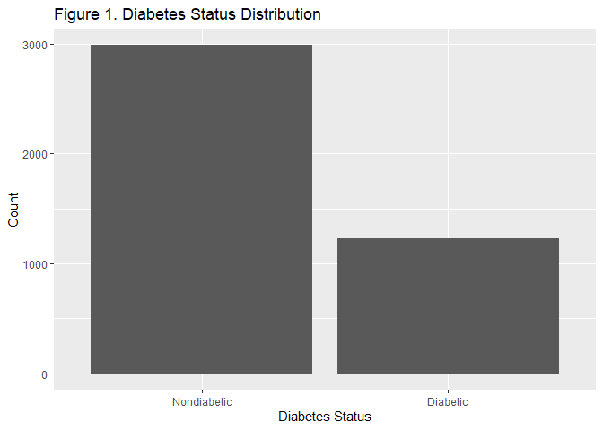
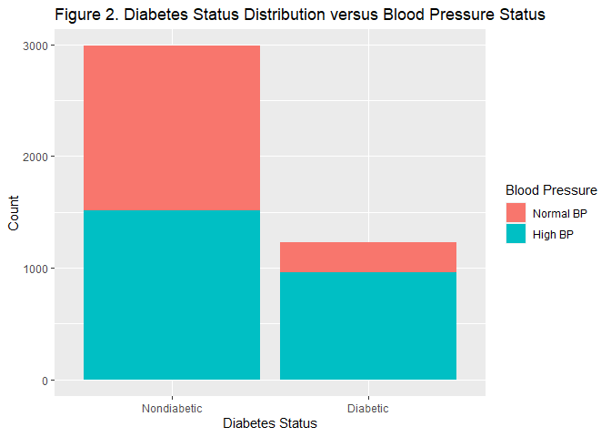
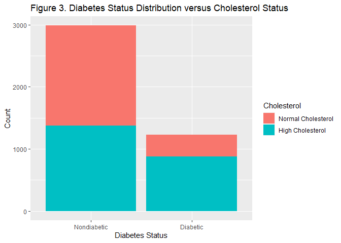
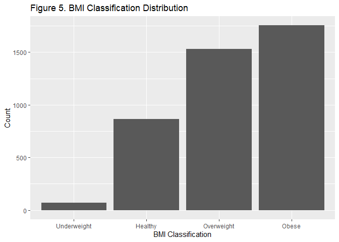
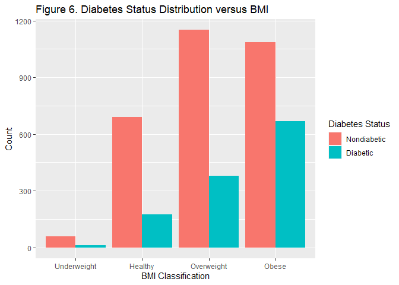
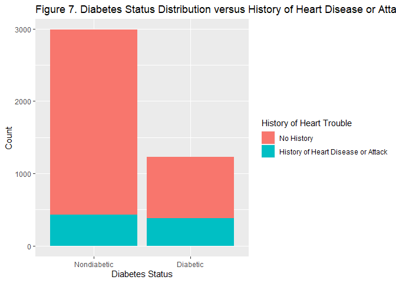
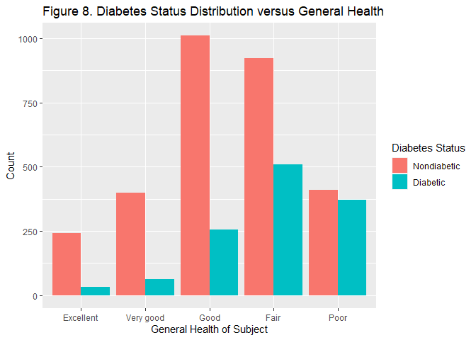
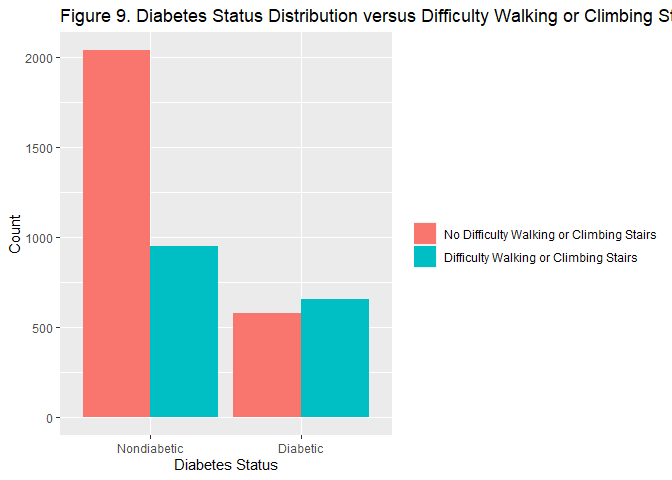
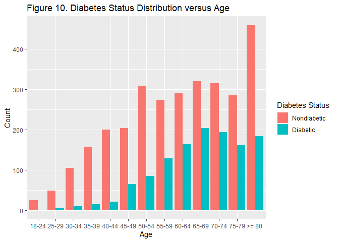

Project 3: Modelling of Diabetes Data for Patients with Education =
Elementary
================
Yvette Callender
2023-11-16

- [Introduction](#introduction)
  - [Data](#data)
  - [Variables](#variables)
  - [Purpose of EDA and Modeling and End
    Results](#purpose-of-eda-and-modeling-and-end-results)
- [Data Set-Up](#data-set-up)
- [Summarizations for Education =
  Elementary](#summarizations-for-education--elementary)
  - [Response Variable:
    `Diabetes_binary`](#response-variable-diabetes_binary)
  - [Predictor variable: `HighBP`](#predictor-variable-highbp)
  - [Predictor variable: `HighChol`](#predictor-variable-highchol)
  - [Predictor variable: `BMI`](#predictor-variable-bmi)
  - [Predictor variable:
    `HeartDiseaseorAttack`](#predictor-variable-heartdiseaseorattack)
  - [Predictor variable: `GenHlth`](#predictor-variable-genhlth)
  - [Predictor variable: `DiffWalk`](#predictor-variable-diffwalk)
  - [Predictor variable: `Age`](#predictor-variable-age)
- [Modeling](#modeling)
  - [Split Data Into Training and
    Test](#split-data-into-training-and-test)
  - [Log Loss Function](#log-loss-function)
  - [Logistic Regression](#logistic-regression)
    - [Description](#description)
    - [Model 1](#model-1)
    - [Model 2](#model-2)
    - [Model 3](#model-3)
    - [Selection of Best Model](#selection-of-best-model)
  - [LASSO Logistic Regression](#lasso-logistic-regression)
    - [Description](#description-1)
    - [Model](#model)

``` r
EducationLevel <- c("Elementary")

output_file <- paste0(EducationLevel, "_tstAnalysis.md")

params = lapply(EducationLevel, FUN = function(x){list(EducationLevel = x)})
reports <- tibble(output_file, params)
apply(reports, MARGIN= 1, FUN = function(x){rmarkdown::render(input="Project 3tst.Rmd", output_file=x[[1]], params = x[[2]])})
```

The following libraries were used in this project.

``` r
library(tidyverse)
library(caret)
```

# Introduction

In this project, data related to diabetes health was analyzed using a
variety of models.

## Data

A Diabetes Health Indicators Dataset:
`diabetes_binary_health_indicators_BRFSS2015.csv` was used for this
project. This dataset can be found online [on
Kaggle](https://www.kaggle.com/code/jerryodegua/eda-prediction-of-diabetes-data)
along with descriptions of the variables.

## Variables

The dataset contains 21 variables than can potentially be used in the
analysis. A subset was chosen and they are described below.

The variable `diabetes_binary` is the response variable for this
analysis. It is either a 0 (corresponding to a lack of either
prediabetes or diabetes) or a 1 (corresponding to the presence of either
prediabetes or diabetes).

The variable `HighBP` is a binary variable with 1 corresponding to high
blood pressure and 0 corresponding to normal blood pressure.

The variable `HighChol` is a binary variable with 1 corresponding to
high cholesterol levels and 0 corresponding to normal cholesterol
levels.

The variable `BMI` (Body Mass Index) is a numeric variable. As part of
the analysis, it was converted to a categorical variable with values
corresponding to underweight (BMI

18.5), normal(18.5

BMI

24.9), overweight(25.0

BMI

29.9) and obese(30

BMI).

The variable `HeartDiseaseorAttack` is a binary variable where 1
indicates a history of heart disease or attack and a 0 indicates a lack
thereof.

The variable `GenHlth` is a categorical variable describing the the
reported level of general health as described below:

| Level | Description |
|:------|:-----------:|
| 1     |  excellent  |
| 2     |  very good  |
| 3     |    good     |
| 4     |    fair     |
| 5     |    poor     |

The variable `DiffWalk` is a binary variable with 1 corresponding to
reported difficulty walking or climbing stairs and 0 corresponding to no
reported difficulty walking or climbing stairs.

The variable `Age` is a categorical variable with the following levels.

| Level |                                                  Description                                                  |
|:------|:-------------------------------------------------------------------------------------------------------------:|
| 1     |                                                18-24 years old                                                |
| 2     |                                                25-29 years old                                                |
| 3     |                                                30-34 years old                                                |
| 4     |                                                35-39 years old                                                |
| 5     |                                                40-44 years old                                                |
| 6     |                                                45-54 years old                                                |
| 7     |                                                50-54 years old                                                |
| 8     |                                                55-59 years old                                                |
| 9     |                                                60-64 years old                                                |
| 10    |                                                65-69 years old                                                |
| 11    |                                                70-74 years old                                                |
| 12    |                                                75-79 years old                                                |
| 13    |  80 years old |

The variable `Education` is a categorical variable with the following
levels.

| Education Level |                         Description                          |
|:----------------|:------------------------------------------------------------:|
| 1               |          Never attended school or only kindergarten          |
| 2               |               Grades 1 through 8 (Elementary)                |
| 3               |                Grades 9-11 (Some high school)                |
| 4               |            Grade 12 or GED (High school graduate)            |
| 5               | College 1 year to 3 years (Some college or technical school) |
| 6               |          College 4 years or more (College graduate)          |

For this analysis, data was divided into subsets based on the value of
`Education`. There are five subsets: one for levels one and two
combined, and one each for levels three, four, five, and six.

## Purpose of EDA and Modeling and End Results

The relationship between the presence of diabetes/prediabetes (as
indicated by `diabetes_binary`) and the predictor variables (`HighBP`,
`HighChol`, `BMI` , `HeartDiseaseorAttack`, `GenHlth`, `DiffWalk`, and
`Age`) were explored at several levels of education, one of which
(Elementary) is reported here. After Exploratory Data Analysis, the
relationships were modeled using a variety or approaches (logistic
regression, LASSO logistic regression, classification tree, random
forest, ridge, and elastic net), and a best model was chosen for the
level of education.

# Data Set-Up

Data was imported and converted to a tibble. Columns corresponding to
categorical variables were converted to factors.

``` r
#Read in Data
diabetes_data <- read.csv ("diabetes_binary_health_indicators_BRFSS2015.csv") %>% 
                 as_tibble


#Select Desired Columns
diabetes_data <- diabetes_data %>%
    select(Diabetes_binary, HighBP, HighChol, BMI, HeartDiseaseorAttack, GenHlth,
           DiffWalk, Age, Education)

#For education make a new column where 1 and 2 are combined
diabetes_data$EducationDerived <- ifelse(diabetes_data$Education == 1 |
                                         diabetes_data$Education == 2 , '1_and_2',
                                         diabetes_data$Education)

#Convert EducationDerived to factor with labels
diabetes_data$EducationDerived <- factor(diabetes_data$EducationDerived, 
                                            levels = c('1_and_2', '3','4','5','6'), 
                                            labels = c("Elementary", 
                                                       "Some High School",
                                                       "High School Graduate", 
                                                       "Some College or Technical School",
                                                       "College Graduate"))

#Convert of binary variable to factors
diabetes_data <- diabetes_data %>% 
    mutate(Diabetes_binary = factor(Diabetes_binary, levels = c("0","1"), 
        labels = c("Nondiabetic", "Diabetic"))) %>%
    mutate(HighBP = factor(HighBP, levels = c("0","1"), 
        labels = c("Normal BP", "High BP"))) %>%
    mutate(HighChol = factor(HighChol, levels = c("0","1"), 
        labels = c("Normal Cholesterol", "High Cholesterol"))) %>%
    mutate(HeartDiseaseorAttack = factor(HeartDiseaseorAttack, levels = c("0","1"), 
        labels = c("No History", "History of Heart Disease or Attack"))) %>%
    mutate(DiffWalk = factor(DiffWalk, levels = c("0","1"), 
        labels = c("No Difficulty Walking or Climbing Stairs", 
                   "Difficulty Walking or Climbing Stairs"))) 

#Convert BMI to ordered factors
diabetes_data <- diabetes_data %>% 
    mutate(BMIFactor = if_else (BMI <= 18.5, "Underweight",
                                if_else (BMI <= 24.9, "Healthy",
                                    if_else (BMI <= 29.9, "Overweight", "Obese"))))
diabetes_data$BMIFactor <- ordered(diabetes_data$BMIFactor, 
                                   levels = c("Underweight","Healthy","Overweight","Obese"))

#Convert age to factors 
diabetes_data <- diabetes_data %>% 
    mutate(Age = factor(Age, 
        levels =  c("1","2","3","4","5","6","7","8","9","10", "11", "12", "13"), 
                 labels = c("18-24", "25-29", "30-34", "35-39", "40-44", "45-49", "50-54",
                          "55-59", "60-64", "65-69", "70-74", "75-79", ">= 80" ))) 

# Convert GenHlth to factors
diabetes_data <- diabetes_data %>% 
    mutate(GenHlth = factor(GenHlth, 
        levels =  c("1","2","3","4","5"), 
                 labels = c("Excellent", "Very good", "Good", "Fair", "Poor")))
```

Data was filtered for the desired education level.

``` r
diabetes_data_subset <- diabetes_data %>% 
    filter(EducationDerived == params$EducationLevel)
```

# Summarizations for Education = Elementary

## Response Variable: `Diabetes_binary`

The amounts of nondiabetics and diabetics in this dataset are:

``` r
#Make and print table
table1 <- table(diabetes_data_subset$Diabetes_binary)
knitr::kable(table1, col.names = c("Diabetes Status", "Frequency"))
```

| Diabetes Status | Frequency |
|:----------------|----------:|
| Nondiabetic     |      2987 |
| Diabetic        |      1230 |

There are 2.4X as many nondiabetics as diabetics in the dataset at
Education = Elementary.

This can be seen graphically here.

``` r
#Base layer
figure1 <- ggplot(diabetes_data_subset, aes(x = Diabetes_binary))
#Build up
figure1 + geom_bar() +
    labs( x = "Diabetes Status",
          y = "Count",
          title = "Figure 1. Diabetes Status Distribution")
```

<!-- -->

## Predictor variable: `HighBP`

The distribution in this dataset for high blood pressure is:

``` r
#Make and print table
table2 <- table(diabetes_data_subset$HighBP)
knitr::kable(table2, col.names = c("Blood Pressure", "Frequency"))
```

| Blood Pressure | Frequency |
|:---------------|----------:|
| Normal BP      |      1740 |
| High BP        |      2477 |

The distribution for diabetes status in this dataset as a function of
blood pressure status is:

``` r
#Make and print table
table3 <- table(diabetes_data_subset$Diabetes_binary,diabetes_data_subset$HighBP)
knitr::kable(table3)
```

|             | Normal BP | High BP |
|:------------|----------:|--------:|
| Nondiabetic |      1472 |    1515 |
| Diabetic    |       268 |     962 |

This can be seen graphically here.

``` r
#Base layer
figure2 <- ggplot(diabetes_data_subset, aes(x = Diabetes_binary))
#Build up
figure2 + geom_bar(aes(fill = HighBP)) +
    labs( x = "Diabetes Status",
          y = "Count",
          title = "Figure 2. Diabetes Status Distribution versus Blood Pressure Status") +
    guides(fill = guide_legend(title = "Blood Pressure"))
```

<!-- -->

## Predictor variable: `HighChol`

The distribution in this dataset for high cholesterol is:

``` r
#Make and print table
table4 <- table(diabetes_data_subset$HighChol)
knitr::kable(table4, col.names = c("Cholesterol", "Frequency"))
```

| Cholesterol        | Frequency |
|:-------------------|----------:|
| Normal Cholesterol |      1965 |
| High Cholesterol   |      2252 |

The distribution for diabetes status in this dataset as a function of
cholesterol status is:

``` r
#Make and print table
table5 <- table(diabetes_data_subset$Diabetes_binary,diabetes_data_subset$HighChol)
knitr::kable(table5)
```

|             | Normal Cholesterol | High Cholesterol |
|:------------|-------------------:|-----------------:|
| Nondiabetic |               1611 |             1376 |
| Diabetic    |                354 |              876 |

This can be seen graphically here.

``` r
#Base layer
figure3 <- ggplot(diabetes_data_subset, aes(x = Diabetes_binary))
#Build up
figure3 + geom_bar(aes(fill = HighChol)) +
    labs( x = "Diabetes Status",
          y = "Count",
          title = "Figure 3. Diabetes Status Distribution versus Cholesterol Status") +
    guides(fill = guide_legend(title = "Cholesterol"))
```

<!-- -->

## Predictor variable: `BMI`

The distribution in this dataset for BMI as a numeric value is
summarized here:

``` r
#Make and print table
table6 <- diabetes_data_subset %>% 
    summarize (Variable = "BMI",
               Minimum = min(BMI),
               Median = median(BMI),
               Maximum = max(BMI),
               Mean = round(mean (BMI),1),
               StdDev = round(sd(BMI),1)
              )
knitr::kable(table6)
```

| Variable | Minimum | Median | Maximum | Mean | StdDev |
|:---------|--------:|-------:|--------:|-----:|-------:|
| BMI      |      12 |     28 |      84 | 29.5 |    7.1 |

This can be visualized as a boxplot:

``` r
figure4<-ggplot() +
         geom_boxplot(aes (y = diabetes_data_subset$BMI))+
         labs (y = "BMI",
               title = "Figure 4. Boxplot for BMI")+
         theme(axis.title.x = element_blank(),
               axis.text.x = element_blank(),
               axis.ticks.x = element_blank())
figure4
```

<!-- -->

Based on [Center for Diseased Control
guidelines](https://www.cdc.gov/healthyweight/assessing/bmi/adult_bmi/index.html),
the variable `BMIFactor` was set to underweight, healthy, overweight, or
obese. The distribution with regard to `BMIFactor` at Education =
Elementary is shown here.

``` r
#Base layer
figure5 <- ggplot(diabetes_data_subset, aes(x = BMIFactor)) 
#Build up
figure5 + geom_bar() +
    labs( x = "BMI Classification",
          y = "Count",
          title = "Figure 5. BMI Classification Distribution")
```

<!-- -->

The effect of BMI on the relative amounts of nondiabetics versus
diabetics is shown here.

``` r
#Base layer
figure6 <- ggplot(diabetes_data_subset, aes(x = BMIFactor))
#Build up
figure6 + geom_bar(aes(fill = Diabetes_binary), position = "dodge") +
    labs( x = "BMI Classification",
          y = "Count",
          title = "Figure 6. Diabetes Status Distribution versus BMI") +
    guides(fill = guide_legend(title = "Diabetes Status"))
```

<!-- -->

## Predictor variable: `HeartDiseaseorAttack`

The distribution in this dataset for a history of heart disease or
attack is:

``` r
#Make and print table
table7 <- table(diabetes_data_subset$HeartDiseaseorAttack)
knitr::kable(table7, col.names = c("History of Heart Trouble", "Frequency"))
```

| History of Heart Trouble           | Frequency |
|:-----------------------------------|----------:|
| No History                         |      3410 |
| History of Heart Disease or Attack |       807 |

The distribution for diabetes status in this dataset as a function of
whether the subject has a history of heart disease or attack is:

``` r
#Make and print table
table8 <- table(diabetes_data_subset$Diabetes_binary,diabetes_data_subset$HeartDiseaseorAttack)
knitr::kable(table8)
```

|             | No History | History of Heart Disease or Attack |
|:------------|-----------:|-----------------------------------:|
| Nondiabetic |       2557 |                                430 |
| Diabetic    |        853 |                                377 |

This can be seen graphically here.

``` r
#Base layer
figure7 <- ggplot(diabetes_data_subset, aes(x = Diabetes_binary))
#Build up
figure7 + geom_bar(aes(fill = HeartDiseaseorAttack)) +
    labs( x = "Diabetes Status",
          y = "Count",
          title = "Figure 7. Diabetes Status Distribution versus History of Heart Disease or Attack") +
    guides(fill = guide_legend(title = "History of Heart Trouble"))
```

<!-- -->

## Predictor variable: `GenHlth`

The distribution in this dataset for the subject’s description of their
general health is:

``` r
#Make and print table
table9 <- table(diabetes_data_subset$GenHlth)
knitr::kable(table9, col.names = c("Subject Description of General Health", "Frequency"))
```

| Subject Description of General Health | Frequency |
|:--------------------------------------|----------:|
| Excellent                             |       275 |
| Very good                             |       461 |
| Good                                  |      1265 |
| Fair                                  |      1434 |
| Poor                                  |       782 |

The distribution for diabetes status in this dataset as a function of
the subject’s description of their general health is:

``` r
#Make and print table
table10 <- table(diabetes_data_subset$Diabetes_binary,diabetes_data_subset$GenHlth)
knitr::kable(table10)
```

|             | Excellent | Very good | Good | Fair | Poor |
|:------------|----------:|----------:|-----:|-----:|-----:|
| Nondiabetic |       243 |       399 | 1010 |  924 |  411 |
| Diabetic    |        32 |        62 |  255 |  510 |  371 |

This can be seen graphically here.

``` r
#Base layer
figure8 <- ggplot(diabetes_data_subset, aes(x = GenHlth))
#Build up
figure8 + geom_bar(aes(fill = Diabetes_binary), position = "dodge") +
    labs( x = "General Health of Subject",
          y = "Count",
          title = "Figure 8. Diabetes Status Distribution versus General Health")+
    guides(fill = guide_legend(title = "Diabetes Status"))
```

<!-- -->

## Predictor variable: `DiffWalk`

The distribution in this dataset for a whether the subject reports
difficulty walking or climbing stairs is:

``` r
#Make and print table
table11 <- table(diabetes_data_subset$DiffWalk)
knitr::kable(table11, col.names = c(" ", "Frequency"))
```

|                                          | Frequency |
|:-----------------------------------------|----------:|
| No Difficulty Walking or Climbing Stairs |      2614 |
| Difficulty Walking or Climbing Stairs    |      1603 |

The distribution for diabetes status in this dataset as a function of
whether the subject reports difficulty walking or climbing stairs is:

``` r
#Make and print table
table12 <- table(diabetes_data_subset$Diabetes_binary,diabetes_data_subset$DiffWalk)
knitr::kable(table12)
```

|             | No Difficulty Walking or Climbing Stairs | Difficulty Walking or Climbing Stairs |
|:------------|-----------------------------------------:|--------------------------------------:|
| Nondiabetic |                                     2039 |                                   948 |
| Diabetic    |                                      575 |                                   655 |

This can be seen graphically here.

``` r
#Base layer
figure9 <- ggplot(diabetes_data_subset, aes(x = Diabetes_binary))
#Build up
figure9 + geom_bar(aes(fill = DiffWalk), position = "dodge") +
    labs( x = "Diabetes Status",
          y = "Count",
          title = "Figure 9. Diabetes Status Distribution versus Difficulty Walking or Climbing Stairs") +
      guides(fill = guide_legend(title = " "))
```

<!-- -->

## Predictor variable: `Age`

The distribution in this dataset for age is:

``` r
#Make and print table
table13 <- table(diabetes_data_subset$Age) 
knitr::kable(table13, col.names = c("Age Range ", "Frequency"))
```

| Age Range | Frequency |
|:----------|----------:|
| 18-24     |        26 |
| 25-29     |        52 |
| 30-34     |       113 |
| 35-39     |       171 |
| 40-44     |       221 |
| 45-49     |       267 |
| 50-54     |       393 |
| 55-59     |       401 |
| 60-64     |       454 |
| 65-69     |       523 |
| 70-74     |       508 |
| 75-79     |       446 |
| \>= 80    |       642 |

The distribution for diabetes status in this dataset as a function of
age is:

``` r
#Make and print table
table14 <- table(diabetes_data_subset$Diabetes_binary,diabetes_data_subset$Age)
knitr::kable(table14)
```

|             | 18-24 | 25-29 | 30-34 | 35-39 | 40-44 | 45-49 | 50-54 | 55-59 | 60-64 | 65-69 | 70-74 | 75-79 | \>= 80 |
|:------------|------:|------:|------:|------:|------:|------:|------:|------:|------:|------:|------:|------:|-------:|
| Nondiabetic |    25 |    48 |   104 |   157 |   200 |   203 |   308 |   273 |   291 |   320 |   315 |   285 |    458 |
| Diabetic    |     1 |     4 |     9 |    14 |    21 |    64 |    85 |   128 |   163 |   203 |   193 |   161 |    184 |

This can be seen graphically here.

``` r
#Base layer
figure10 <- ggplot(diabetes_data_subset, aes(x = Age))
#Build up
figure10 + geom_bar(aes(fill = Diabetes_binary), position = "dodge") +
    labs( x = "Age",
          y = "Count",
          title = "Figure 10. Diabetes Status Distribution versus Age") +
    guides(fill = guide_legend(title = "Diabetes Status "))
```

<!-- -->

# Modeling

## Split Data Into Training and Test

The `createDataPartition` from `caret` was used to partition the data
into training (70% of the data) and test (30% of the data) sets.
Diabetics and non-diabetics were split separately.

``` r
#for reproducibility
set.seed(1331)

#generate indices for split 
trainIndex <-createDataPartition(diabetes_data_subset$Diabetes_binary, p =0.7, list=FALSE)

#split data
diabetes_data_subset_train <- diabetes_data_subset[trainIndex,]
diabetes_data_subset_test <- diabetes_data_subset[-trainIndex,]
```

## Log Loss Function

[Reference](https://www.youtube.com/watch?v=MztgenIfGgM)

Logarithmic loss (or log loss or cross-entropy loss) is a performance
measure for a binary classification model which outputs a probability
between 0 and 1. Values for log loss can range from 0 to

infinity, with 0 representing a perfect model. The equation for
determining Log Loss is:

)+(1-y_i)log (1-p(y_i))")

It has a desirable feature of being convex and having a single global
minimum. This is in contrast to the MSE (mean square error) function
used in linear regression which is not convex and can have many local
minima, which makes it unsuitable for use in logistic regression.

When accuracy is used as a performance measure, it only takes right and
wrong into account; whereas the log loss function has weighting terms
that take into account just how wrong the model is. While accuracy would
treat probabilities of 0.05 and 0.45 for a true “1” as equally wrong,
log loss would impose a much higher penalty (3.8 X greater) on the
confident but wrong p=0.05.

Log loss analysis can be incorporated into `caret` by setting the
`metric = logloss` and using `summaryFunction = mnLogLoss` in
`trControl`.

## Logistic Regression

[Reference](https://www.youtube.com/watch?v=MztgenIfGgM)

### Description

Logistic Regression is a method used on dataset where the response
(dependent) variable is binary. The response variable is fit as a
logistic sigmoid function of independent variables which can be
continuous or binary. The general form of the equation is


where X is a vector containing all the predictor variables. The range of
this function is 0-1, which works well with a binary dependent
variable.  
The logistic function is linked to the X vector with the logit function.


### Model 1

The first candidate logistic regression model includes all the following
variables:
`HighBP`,`HighChol`,`BMIFactor`,`HeartDiseaseorAttack`,`GenHlth`,`DiffWalk`,
and `Age`.

This
[reference](https://machinelearningmastery.com/machine-learning-evaluation-metrics-in-r/)
was used for incorporating log loss into `trControl` and `train`.

``` r
#Set up formula
outcome <- "Diabetes_binary"
variables <- c('HighBP','HighChol','BMIFactor','HeartDiseaseorAttack','GenHlth','DiffWalk','Age')
formula_logistic_1 <- as.formula(paste (outcome, 
                                        paste(variables, collapse = " + "), 
                                        sep = " ~ "))
formula_logistic_1
```

    ## Diabetes_binary ~ HighBP + HighChol + BMIFactor + HeartDiseaseorAttack + 
    ##     GenHlth + DiffWalk + Age
    ## <environment: 0x000002d079940c28>

``` r
#for reproducibility
set.seed(1331)

#Perform fit using logLoss with 5 fold cross validation
fit_logistic_1 <- train(formula_logistic_1,
                        data = diabetes_data_subset_train,
                        method = "glm",
                        family = "binomial",
                        trControl = trainControl(method = "cv", number = 5,
                                                 classProbs = TRUE, 
                                                 summaryFunction = mnLogLoss),
                        metric = "logLoss"
                        )

knitr::kable(fit_logistic_1[[4]][2], digits = 4, align = "l")
```

| logLoss |
|:--------|
| 0.5283  |

### Model 2

The second candidate logistic regression model includes all the
following variables:
`HighBP`,`HighChol`,`BMIFactor`,`HeartDiseaseorAttack`,`GenHlth`,and
`DiffWalk`.

``` r
#Set up formula
outcome <- "Diabetes_binary"
variables <- c('HighBP','HighChol','BMIFactor','HeartDiseaseorAttack','GenHlth','DiffWalk')
formula_logistic_2 <- as.formula(paste (outcome, 
                                        paste(variables, collapse = " + "), 
                                        sep = " ~ "))
formula_logistic_2
```

    ## Diabetes_binary ~ HighBP + HighChol + BMIFactor + HeartDiseaseorAttack + 
    ##     GenHlth + DiffWalk
    ## <environment: 0x000002d079940c28>

``` r
#for reproducibility
set.seed(1331)

#Perform fit using logLoss with 5 fold cross validation
fit_logistic_2 <- train(formula_logistic_2,
                        data = diabetes_data_subset_train,
                        method = "glm",
                        family = "binomial",
                        trControl = trainControl(method = "cv", number = 5,
                                                 classProbs = TRUE, 
                                                 summaryFunction = mnLogLoss),
                        metric = "logLoss"
                        )

knitr::kable(fit_logistic_2[[4]][2], digits = 4, align = "l")
```

| logLoss |
|:--------|
| 0.5259  |

### Model 3

The third candidate logistic regression model includes all the following
variables: `HighBP`,`HighChol`,`BMIFactor`, and `HeartDiseaseorAttack`.

``` r
#Set up formula
outcome <- "Diabetes_binary"
variables <- c('HighBP','HighChol','BMIFactor','GenHlth')
formula_logistic_3 <- as.formula(paste (outcome, 
                                        paste(variables, collapse = " + "), 
                                        sep = " ~ "))
formula_logistic_3
```

    ## Diabetes_binary ~ HighBP + HighChol + BMIFactor + GenHlth
    ## <environment: 0x000002d079940c28>

``` r
#for reproducibility
set.seed(1331)

#Perform fit using logLoss with 5 fold cross validation
fit_logistic_3 <- train(formula_logistic_3,
                        data = diabetes_data_subset_train,
                        method = "glm",
                        family = "binomial",
                        trControl = trainControl(method = "cv", number = 5,
                                                 classProbs = TRUE, 
                                                 summaryFunction = mnLogLoss),
                        metric = "logLoss"
                        )

knitr::kable(fit_logistic_3[[4]][2], digits = 4, align = "l")
```

| logLoss |
|:--------|
| 0.5301  |

### Selection of Best Model

``` r
#Use if else statements to select logistic model with lowest Log Loss
if (fit_logistic_1[[4]][2]<fit_logistic_2[[4]][2]  &
    fit_logistic_1[[4]][2]<fit_logistic_3[[4]][2]) {
    fit_logistic <-fit_logistic_1
    } else if (fit_logistic_2[[4]][2]<fit_logistic_3[[4]][2]) {
          fit_logistic <-fit_logistic_2
          } else {fit_logistic <-fit_logistic_3}

# Store method and logloss to facilitate comparison
logistic_results <- as_tibble(fit_logistic[[4]][2]) %>% 
    mutate (Method = "Logistic") %>%
    select (Method, logLoss)

knitr::kable(logistic_results, digits = 4, align = 'll')
```

| Method   | logLoss |
|:---------|:--------|
| Logistic | 0.5259  |

## LASSO Logistic Regression

[Reference](https://www.mygreatlearning.com/blog/understanding-of-lasso-regression/)

### Description

Least Absolute Shrinkage and Selection Operator (LASSO) is a penalized
method for modelling. It is used in an attempt to balance accuracy and
simplicity. The penalty (assuming n predictor variables) is calculated
as

")


is a tuning parameter. Larger values of

push more coefficients to zero- leading to sparser models, while smaller
values of

allow more non-zero coefficients- corresponding to more complex models.

During the modelling the function that is minimized- referred to as the
objective function- is the sum of the penalty function and the cost
function (which for this logistic regression will be log loss).

")

### Model

``` r
#Set up formula
outcome <- "Diabetes_binary"
variables <- c('HighBP','HighChol','BMIFactor','HeartDiseaseorAttack','GenHlth','DiffWalk', 'Age')
formula_lasso <- as.formula(paste (outcome, 
                                   paste(variables, collapse = " + "), 
                                   sep = " ~ "))
formula_lasso
```

    ## Diabetes_binary ~ HighBP + HighChol + BMIFactor + HeartDiseaseorAttack + 
    ##     GenHlth + DiffWalk + Age
    ## <environment: 0x000002d079940c28>

``` r
#Set up lambdas parameter for tuneGrid
lambdas <- 10^seq(0, -4, by = -.1)

#for reproducibility
set.seed(1331)

#Perform fit using logLoss with 5 fold cross validation
fit_lasso <- train(formula_lasso,
                   data = diabetes_data_subset_train,
                   method = "glmnet",
                   family = "binomial",
                   trControl = trainControl(method = "cv", number = 5,
                                            classProbs = TRUE,               
                                            summaryFunction = mnLogLoss),
                   metric = "logLoss",
                   tuneGrid = expand.grid (alpha = 1, lambda = lambdas)
                   )

#Best lambda after tuning
fit_lasso$bestTune$lambda
```

    ## [1] 0.002511886

``` r
#Extract logLoss and store with method to facilitate comparison
lasso_results <- fit_lasso[[4]] %>% 
    filter(lambda == fit_lasso$bestTune$lambda) %>%
    mutate(Method = "LASSO") %>%
    select(Method, logLoss)

knitr::kable(lasso_results,digits = 4, align = "ll")
```

| Method | logLoss |
|:-------|:--------|
| LASSO  | 0.5174  |
